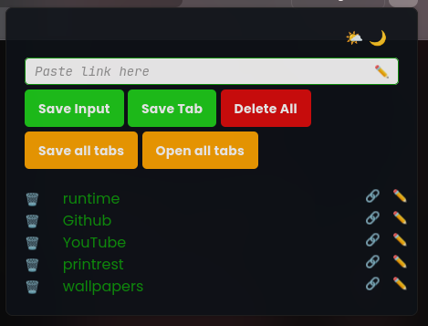
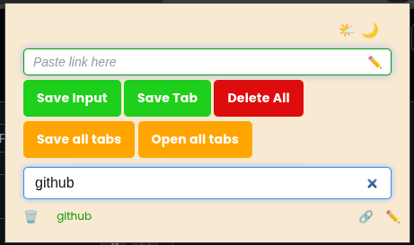

# Smart Link Saver Chrome Extension

`A lightweight and powerful Chrome Extension that helps you save, rename, and manage your favorite links right from your browser.`

`Designed for developers, students, and professionals who need a quick and efficient way to organize their browsing workflow.`

---

## Dark Mode Screenshot



## Light Mode Screenshot




## ⚡ Features

- 💾 Save Input: Manually add custom links or notes.
- 🌐 Save Tab: Instantly save the current browser tab’s URL.
- ✏️ Rname Links: Edit and rename saved links for clarity.
- 🗑️ Delete Links: Remove old or unnecessary links in one click.
- 📁 Persistent Storage: Saved links remain available even after restarting the browser.
- 🎨 Clean UI: Simple, intuitive, and user-friendly interface.
- ⚙️ Lightweight: Minimal resource usage and fast performance.
- 🔗 edit Link.
- Save all the opened tabs in the current Focused window, If the url is not already saved it will be added or else will be skipped.
- Open all the Saved tabs, it will open every saved link in a new tab.


## 🧩 Installation (Manual)

Follow these steps to install the extension manually on major browsers:

### Chrome / Brave / Edge
1. Download the `tab-leads.zip` from the latest [Releases](https://github.com/TusharKumar1007/tab-leads/releases) page.
2. Unzip `tab-leads.zip`   into a folder call it `Extentions` .
3. Open your browser and go to the extensions page:
   - **Chrome / Edge:** `chrome://extensions/`
   - **Brave:** `brave://extensions/`
4. Enable **Developer Mode** (toggle in the top right corner).
5. Click **Load Unpacked** and select the unzipped folder i.e ```tab-leads```.
6. The extension icon will appear in your toolbar — ready to use!
```**step 2 is very important if you don't want to loose your saved links.**```

### Firefox
1. Download the latest release from the [Releases](https://github.com/TusharKumar1007/tab-leads/releases) page.
2. Unzip the downloaded file.
3. Open Firefox and go to the Add-ons page: `about:debugging#/runtime/this-firefox`
4. Click **Load Temporary Add-on…**
5. Select the `manifest.json` file inside the unzipped folder.
6. The extension will be loaded temporarily (it will disappear after restarting Firefox, for permanent installation consider publishing to [addons.mozilla.org](https://addons.mozilla.org/)).

---

## 📂 Project Structure
```
.
├── manifest.json          # Extension configuration and permissions
├── popup.html             # UI layout for popup window
├── popup.js               # Core logic (save, delete, rename links)
├── style.css              # Custom styles for popup
├── icons/                 # Extension icons
└── README.md              # Documentation (this file)
```
---

## 🚀 Usage
```bash

Click the Smart Link Saver icon in your Chrome toolbar.
Type a link manually or click Save Tab to store the current tab’s URL.
Rename saved links with the ✏️ icon.
Delete any saved link using the 🗑️ button.
Click Delete All to clear your entire list (optional).
```
Simple, fast, and perfect for keeping your digital workspace organized!

